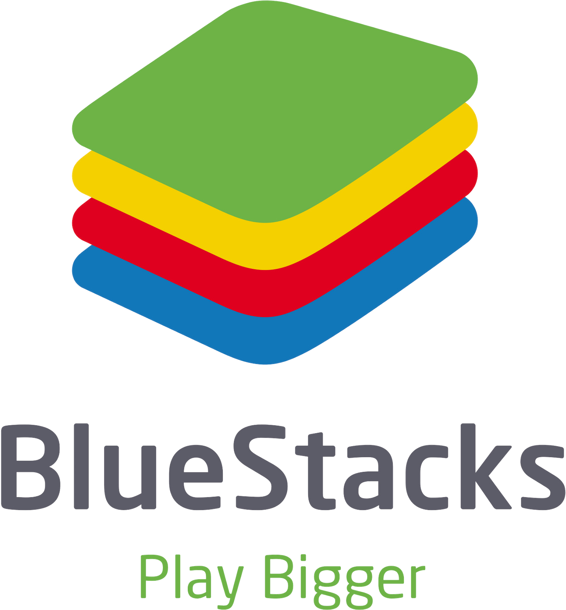

  

 

# Porfolio
- [Sobre mí](#sobre-mí)
- [CV](#cv)
- [Skills](#skills)
- [Herramientas](#herramientas)
- [Estudios IT](#estudios-it)
- [Cursos](#cursos)
- [Proyectos realizados](#proyectos-realizados)
  * [Sinfonia de Algoritmos](#Sinfonia-de-algoritmos)
  * [PHIcode-woman](#PHIcode-woman)
  * [Orimi](#Orimi)
  * [No Country](#No-Coutry)  
  * [Survio](#survio)
  * [Calculadora para piscinas](#calculadora-para-piscinas)

 
 
 

## Sobre mí 

Mis habilidades están comprendidas por el testing manual y automatizado, así como la generación de documentación de requisitos funcionales. 

Una de mis mayores motivaciones es la curiosidad por encontrar y optimizar los procesos de trabajo relacionados con el testing de software.

## CV

Puedes descargar mi CV en [PDF aquí.](./Media/Silvana%20Loureiro%20QA%20%202024.pdf)

## Skills

Puedes visualizar cómo fueron aplicados en diferentes proyectos en [proyectos realizados](#proyectos-realizados).

__Manual testing__
   * Estas pruebas se aplicaron en varias plataformas (Web, Mobile y Desktop).
   * Las pruebas fueron a nivel de Usuario y Funcionales.

__Análisis y diseño de casos de prueba__
  * Creación de listado de funcionalidades.
  * Plantillas con variables de una funcionalidad.
  * Creación de casos de prueba con las técnicas:
      * Testing exploratorio.
      * Máquinas de estado.
      * Árbol de decisiones.
      * Combinación por pares.
      * Clases de equivalencia y valores límite.
      * Guías para automatización de pruebas.

__Documentación__
  * Creación de reportes de incidentes concisos y de valor en diferentes plataformas.
  * Creación de Mapas mentales y flujos de datos.
  * Asignación de calificaciones a los incidentes (Severidad, Prioridad, etc).
  * Creación de reportes de Testing Exploratorios completos.
  * Creación de informes completos.
  * Creación de informes con análisis de los incidentes Reportados/Solucionados/Pendientes por sprints.

## Herramientas

__Editor y gestor de código__

*   &nbsp;&nbsp;&nbsp;&nbsp; GitHub

*  &nbsp;&nbsp;&nbsp;&nbsp;Visual Studio Code  
 

__Automatización__
*  &nbsp;&nbsp;&nbsp;&nbsp;SeleniumIDE 
 

__API__
*  &nbsp;&nbsp;&nbsp;&nbsp;Postman 
*  &nbsp;&nbsp;&nbsp;&nbsp;Swagger 
 

__Diseño__
*  &nbsp;&nbsp;&nbsp;&nbsp;Figma

*  &nbsp;&nbsp;&nbsp;&nbsp;Canva 
 

__SQL__
* &nbsp;&nbsp;&nbsp;&nbsp;PostreSQL

* &nbsp;&nbsp;&nbsp;&nbsp;SQLite  
 

 __Gestión de incidencias__
*  &nbsp;&nbsp;&nbsp;&nbsp;Jira

*  &nbsp;&nbsp;&nbsp;&nbsp;Trello

*  &nbsp;&nbsp;&nbsp;&nbsp;Mantis BT  
 

__Generación de CP con combinación por pares__
*  &nbsp;&nbsp;&nbsp;&nbsp;PICT online o escritorio 
 

__Ofice__
*  &nbsp;&nbsp;&nbsp;&nbsp;Excel Avanzado  
 

__Emuladores__
*  &nbsp;&nbsp;&nbsp;&nbsp;BlueStacks 5 

 

## Estudios IT

__Tester de Software__  
*03/2023 - 12/2023 · Centro de Ensayos de Software*  
Curso anual completo, en la Escolaridad se puede observar también el programa.  
 [Escolaridad](/Media/Escolaridad.pdf) | [Diploma](/Media/Diplomas/ProgramaciónTesters.jpg)   
 *Completo*

## Cursos
__Programación para testers__  
*Curso online de [The Free Ranger Tester](https://www.udemy.com/user/patricio-miner/) · Udemy*  
Curso básico de 3 hs.    
 [Certificado](/Media/Diplomas/ProgramaciónTesters.jpg)    
 _Completo_

__SQL__  
*Curso online de [Desafío Latam](https://desafiolatam.com/)*  
Tutorial de SQL interactivo con certificación por módulo.  
 [Certificados](/Media/Diplomas/Certificados%20SQL.pdf) 
 _Completo_

__Liderazgo con inteligencia emocional__  
*Curso online de [LinkedIn](https://www.linkedin.com/learning/liderazgo-con-inteligencia-emocional-22700687/liderazgo-con-inteligencia-emocional)*  
Identifica y aplica pautas concretas en la gestión de equipos y mejora tu productividad personal y laboral gracias a las últimas investigaciones en ciencia cognitiva.  
 [Certificado](https://www.linkedin.com/learning/certificates/abd0a1dd889c973f056145635c5e7b299eed4e02dc2c50107d23e50f847a994b?lipi=urn%3Ali%3Apage%3Ad_flagship3_profile_view_base_certifications_details%3BJtjB%2F6JmRZCAxOxiV4enRQ%3D%3D)  
 _Completo_

__Python__  
*Curso online de [Marco Mendoza](https://www.udemy.com/user/mendoza-limon-marco-antonio/)*  
 Curso que cuenta con 4 partes.  
 _Cursando_

## Proyectos realizados

### Sinfonia de algoritmos
*06/2024 - Actualmente*
* Proyecto relizado en voluntariado con [AuJ](https://www.adoptaunjunior.es/) para [Manfred](https://www.getmanfred.com/) en progreso...  

### PHIcode-woman
*05/2024 - Actualmente*
 
* Proyecto relizado en voluntariado con [AuJ](https://www.adoptaunjunior.es/) para [PHI Alliance](http://www.phialliance.org/) en progreso...  

### Orimi
*04/2024 - Actualmente*
* Estamos desarrollando una plataforma e-commerce de Origami.  
Proyecto en progreso...  
  [GitHub](https://github.com/PedroVegaDamian/Orimi)&nbsp; |&nbsp; [Web](https://orimi-develop.vercel.app)

   &nbsp;&nbsp;&nbsp;&nbsp; 

### No Coutry
*03/2024 - 04/2024*
*  [No Country](https://www.nocountry.tech/) es un simulador laboral de 5 semanas cada proyecto.

    Proyecto "Nexus IT Service"  
    03/2024 - 04/2024  

    Es una web que busca agilizar la gestión entre clientes, operarios y administradores de una empresa (Nexus) que brinda outsourcing de sistemas IT. 

    En mi rol de QA Manual:
     - Diseñé casos de prueba.
     - Ejecuté casos de prueba (Front y Back).
     - Automaticé pruebas de regresión.  
  
    En mi Rol como SCRUM Master:
     - Creé el Trello para la organización del proyecto.
     - Di prioridad a las tareas.
     - Organicé el equipo para orientarlo a resultados.  
    
    La documentación se encuentra en GitHub.  

    [GitHub](https://github.com/No-Country/c17-32-node-react) | [README](https://github.com/SLouQA/README-No-Country-c17-32)  
   
     &nbsp;&nbsp;&nbsp;&nbsp;  &nbsp;&nbsp;&nbsp;&nbsp;  &nbsp;&nbsp;&nbsp;&nbsp;  &nbsp;&nbsp;&nbsp;&nbsp; &nbsp;&nbsp;&nbsp;&nbsp;  &nbsp;&nbsp;&nbsp;&nbsp;  

 

### Survio
[Web](https://www.survio.com/es/) 
*11/2023*
* Como prueba final del curso del diploma Tester de Software (CES) se presentó:
     * Presentar un informe completo de lo realizado. | [.pdf](./Media/Proyectos/Survio/Informe_%20PruebaFinal_SLoureiro.pdf)
     * Crear un listado de Funcionalidades. | [.xls](./Media/Proyectos/Survio/1%20_%20Inventario%20de%20Funcionalidades/Prueba%20final_Inventario%20de%20Funcionalidades_SLoureiro.xlsx)
     * Diseñar y ejecutar casos de prueba para la funcionalidad "Crear nueva encuesta" los cuales fueron ralizados con máquina de estado. | [.xls](./Media/Proyectos/Survio/2%20_%20Máquina%20de%20estado/Tabla%20de%20transición%20y%20CP_SLoureiro.xlsx)
     * Ejecutar una sesión de Testing exploratorio. | [.doc](./Media/Proyectos/Survio/3%20_%20Testing%20Exploratorio/Sesión%20ET_%20SLoureiro.docx)
     * Crear casos de prueba para las opciones avanzadas y básicas de una encuesta por medio de combinación por pares. | [.txt](./Media/Proyectos/Survio/4%20_%20Comb.%20por%20pares/Entrada_SLoureiro.txt) | [.xls](./Media/Proyectos/Survio/4%20_%20Comb.%20por%20pares/Salida_SLoureiro.xlsx)
     * Crear, modificar y hacer consultas en DB SQL. | [.pdf](./Media/Proyectos/Survio) | [.sql](./Media/Proyectos/Survio/5%20_%20SQL/SQLite.sql)
     * Crear un guión para automatizar la prueba "Dar de alta una encuesta". | [.pdf](./Media/Proyectos/Survio/6%20_%20Guión%20de%20automatización/Guion_PruebaFinal_SLoureiro.pdf)
     * Reportar 3 de los bugs de los encontrados. | [.pdf](./Media/Proyectos/Survio/Insidentes/Bugs.pdf)

      &nbsp;&nbsp;&nbsp;&nbsp;  &nbsp;&nbsp;&nbsp;&nbsp;  &nbsp;&nbsp;&nbsp;&nbsp;  &nbsp;&nbsp;&nbsp;&nbsp;  
  
### Calculadora para piscinas
[APP](https://play.google.com/store/apps/details?id=com.israel.montero.fernando.calculadorapiscinas&hl=es_UY&gl=US&pli=1) 
*06/2023*
* Como prueba final del primer semestre en CES se presentó:
    * Un informe completo de lo realizado. | [.pdf](./Media/Proyectos/Calculadora/Informe%20prueba%20final_SLoureiro.pdf)
    * Un informe del Testing exploratorio realizado. | [.pdf](./Media/Proyectos/Calculadora/ET_Calculo%20floculante%20líquido_SLoureiro.pdf)
    * Un [Excel](./Media/Proyectos/Calculadora/Prueba%20final_Inventario%20de%20Funcionalidades_SLoureiro.xlsx) con:
        * Inventario de funcionalidades (excluyendo las "premium")
        * Variables de la funcionalidad "Calcular el cloro"
        * Diseño y ejecución de casos de prueba con clases de equivalencia.
    * Reportes en Mantis BT. | [.pdf](./Media/Proyectos/Calculadora/Bugs.pdf) (Las imágenes no se visualizan.)

      &nbsp;&nbsp;&nbsp;&nbsp;  
 
